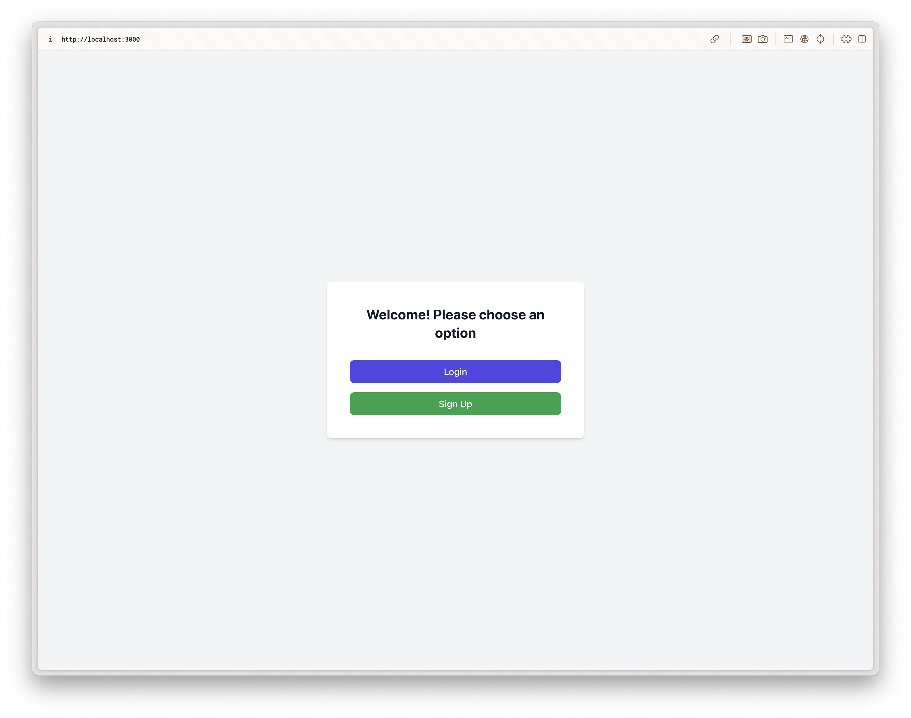
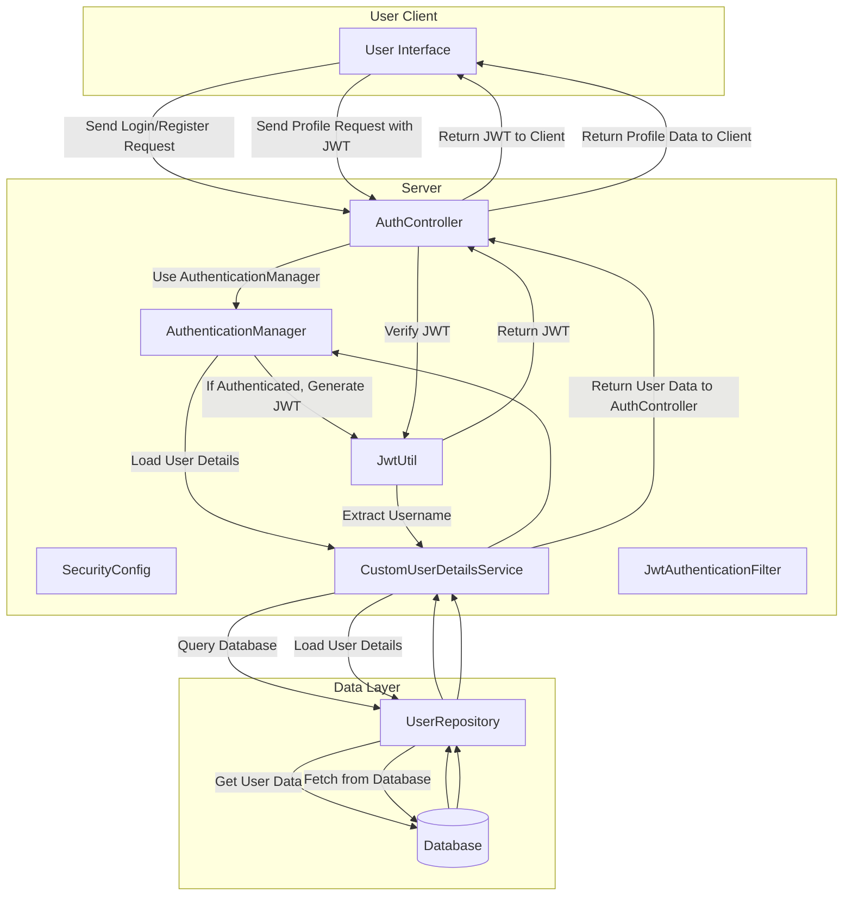
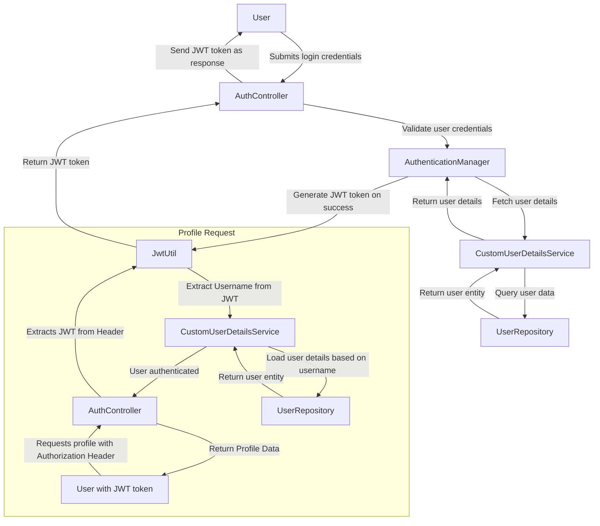

# CloudAuthSystem

A Spring Boot-based authentication and authorization system with JWT (JSON Web Token) for secure user login, registration, and profile management, now with a React frontend UI.



## Overview

This project implements a simple authentication system that allows users to register, log in, and access a protected profile endpoint. It uses **JWT** for stateless, secure authentication, **Spring Security** for configuring access control, and a **React** frontend for a user-friendly interface.

### Features
- **User Registration:** Allows users to register with a unique username and password.
- **User Login:** Authenticates users and returns a JWT on successful login.
- **Protected Profile Access:** Uses the JWT to access a protected endpoint that displays the user's profile.
- **React Frontend with UI Animation:** Provides a simple, interactive interface with animated success messages and a “happy clacker” background animation upon login success.

## System Architecture

The architecture of this application is divided into three main layers:

1. **User Client (Frontend/Client)**: The user interacts with the application through a React frontend for registration, login, and profile access.
2. **Server (Backend)**: Handles requests, manages user authentication, and generates/validates JWTs.
3. **Data Layer**: Manages data persistence using a database to store user details.



## Data Flow Diagram (DFD)

Below is the flow of data between the client, backend, and database, illustrated in a Data Flow Diagram:



## Project Structure

```
src
├── main
│   ├── java
│   │   └── org.example.cloudauthsystem
│   │       ├── config
│   │       │   ├── SecurityConfig.java
│   │       │   └── JwtAuthenticationFilter.java
│   │       ├── controllers
│   │       │   └── AuthController.java
│   │       ├── models
│   │       │   └── User.java
│   │       ├── repositories
│   │       │   └── UserRepository.java
│   │       ├── services
│   │       │   └── CustomUserDetailsService.java
│   │       └── util
│   │           └── JwtUtil.java
│   └── resources
│       └── application.properties
├── frontend
│   ├── public
│   │   └── index.html
│   └── src
│       ├── App.js
│       ├── components
│       │   ├── Login.js
│       │   └── SignUp.js
│       └── styles
│           └── App.css
└── test
```

## Key Components

1. **AuthController**: Handles endpoints for user registration, login, and profile access.
2. **SecurityConfig**: Configures security, defines allowed routes, and integrates the `JwtAuthenticationFilter`.
3. **JwtAuthenticationFilter**: Intercepts requests, verifies JWT tokens, and sets the authentication context.
4. **JwtUtil**: Utility for generating and validating JWTs.
5. **CustomUserDetailsService**: Loads user details for authentication and authorization.
6. **UserRepository**: Interfaces with the database to store and retrieve user details.
7. **React Frontend**: A responsive UI that allows users to interact with the application for registration, login, and profile access.

## How to Run the Application

1. **Clone the repository**:
   ```bash
   git clone https://github.com/yourusername/cloudauthsystem.git
   cd cloudauthsystem
   ```

2. **Configure the Database**:
   Update `src/main/resources/application.properties` with your database credentials.

3. **Run the Backend Server**:
   ```bash
   ./mvnw spring-boot:run
   ```

4. **Install Frontend Dependencies**:
   ```bash
   cd frontend
   npm install
   ```

5. **Run the Frontend**:
   ```bash
   npm start
   ```

6. **Access Endpoints**:
   - Frontend: `http://localhost:3000`
   - Backend: `http://localhost:8080`

## Usage Example in Postman

1. **Register a New User**:
   - Method: `POST`
   - URL: `http://localhost:8080/api/auth/register`
   - Body (JSON):
     ```json
     {
       "username": "testuser",
       "password": "testpass"
     }
     ```

2. **Login**:
   - Method: `POST`
   - URL: `http://localhost:8080/api/auth/login`
   - Body (JSON):
     ```json
     {
       "username": "testuser",
       "password": "testpass"
     }
     ```
   - **Response**:
     ```json
     {
       "token": "your-jwt-token"
     }
     ```

3. **Access Profile**:
   - Method: `GET`
   - URL: `http://localhost:8080/api/auth/profile`
   - Headers:
     ```plaintext
     Authorization: Bearer your-jwt-token
     ```

## Screenshots

### UI Home
*Place an image here showing the main login page*

### Registration Page
*Place an image here showing the registration form*

### Login Success Animation
*Place an image or gif of the happy clacker background animation on successful login*

## License

This project is licensed under the MIT License - see the LICENSE file for details.
